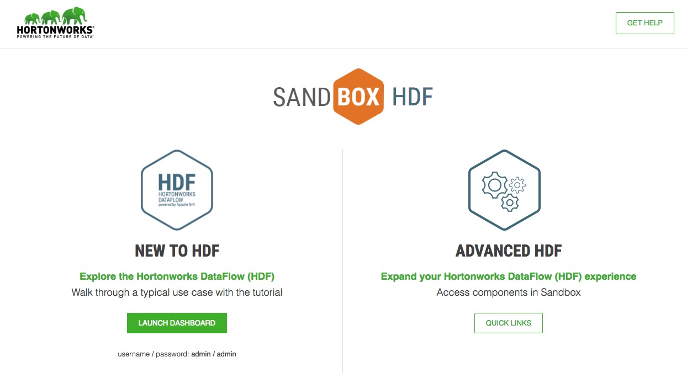
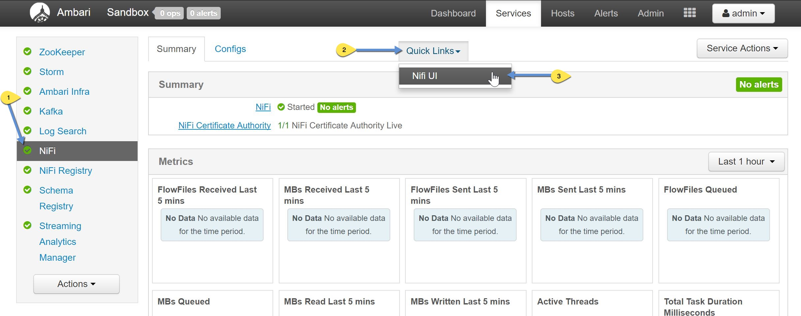
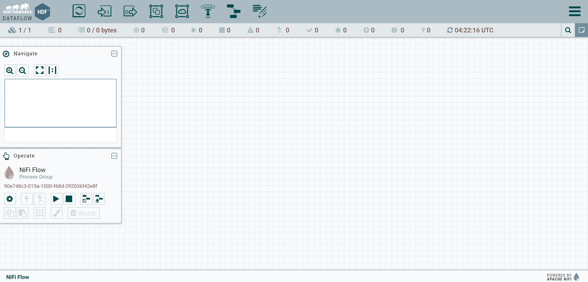
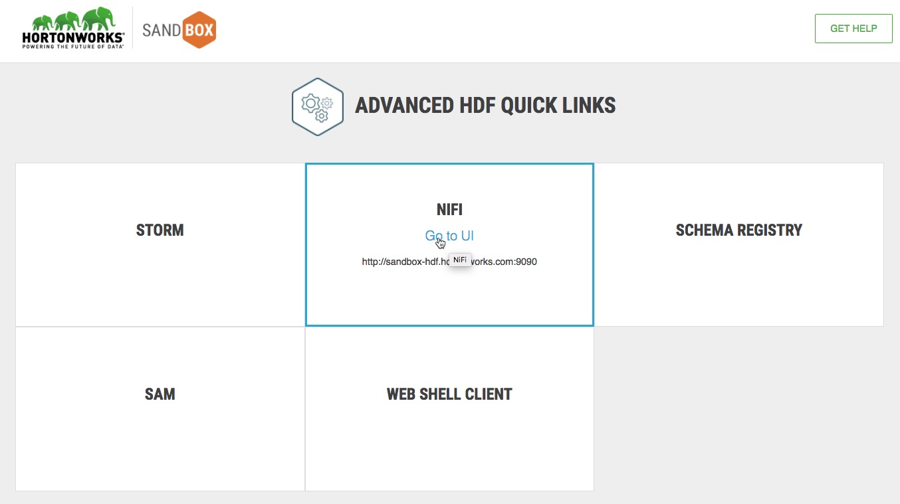

# Launch NiFi HTML UI

## Introduction

With the Hortonworks DataFlow (HDF) Sandbox, Apache NiFi comes preinstalled in the Ambari Stack and preconfigured out of the box to utilize many of its features. In the tutorial, it shows you how to access the NiFi HTML UI in one of two ways: use the HDF Splash Screen Page "Advanced Quick Links" or Ambari UI "Quick Links".

## Prerequisites
-   Completed the prior tutorials within this tutorial series
-   Downloaded [HDF Sandbox](https://hortonworks.com/products/sandbox/) for VMWare, VirtualBox or Native Docker
-   [Installed and Deployed HDF Sandbox](https://hortonworks.com/tutorial/sandbox-deployment-and-install-guide/) for VMWare, VirtualBox or Native Docker
-   Added HDF Sandbox Hostname to Your Hosts File, refer to [Learning the Ropes of the HDF sandbox](https://hortonworks.com/tutorial/getting-started-with-hdf-sandbox/)

## Outline
-   [Step 1: Open HDF Splash Page](#step-1-open-hdf-splash-page)
-   [Approach 1: Access NiFi HTML UI via Ambari Dashboard](#approach-1-access-nifi-html-ui-via-ambari-dashboard)
-   [Approach 2: Launch NiFi HTML UI from HDF Splash Quick Links](#approach-2-launch-nifi-html-ui-from-hdf-splash-quick-links)
-   [Summary](#summary)

> Note: For VMware users, you will need to add the auto generated IP address on startup of your virtual machine followed by HDF Sandbox hostname to your hosts file, example `192.168.17.129 sandbox-hdf.hortonworks.com`. On MAC, open `/private/etc/hosts`; LINUX, open `/etc/hosts`; WINDOWS 10, open `C:\Windows\System32\drivers\etc\hosts` as an administrator.

### Step 1: Open HDF Splash Page

1\. Open `sandbox-hdf.hortonworks.com:1080` with your favorite web browser:

Choose either approach to access NiFi UI.

### Approach 1: Access NiFi HTML UI via Ambari Dashboard

1\. Select the **LAUNCH DASHBOARD** button

2\. Type `admin/admin` to login to Ambari.

3\. Select the **NiFi Service**, click on **Quick Links** dropdown and press the **NiFi UI**:

4\. The NiFi UI comes with a default Trucking-IoT NiFiFlow as seen on the image below. To delete the default NiFiFlow and work with a new canvas select the NiFiFlow (cltr+A for Mac) then right click and select delete.

Sample of a clean NiFi Canvas:

### Approach 2: Launch NiFi HTML UI from HDF Splash Quick Links

1\. Select the **QUICK LINKS** button

2\. Hover over the **NiFi** box and select **Go to UI**

3\. The NiFi UI comes with a default Trucking-IoT NiFiFlow as seen on the image below. To delete the default NiFiFlow and work with a new canvas select the NiFiFlow (cltr+A for Mac) then right click and select delete.

Sample of a clean NiFi Canvas:

## Summary

Congratulations! You explored two approaches for launching NiFi UI. You opened the HDF Splash Page: Approach 1 was launching the Ambari Dashboard from the "New To HDF path" while Approach 2 was using the NiFi Quick Link from the "Advanced HDF path". Now you are ready to explore the next tutorial to began building our simple dataflow.
