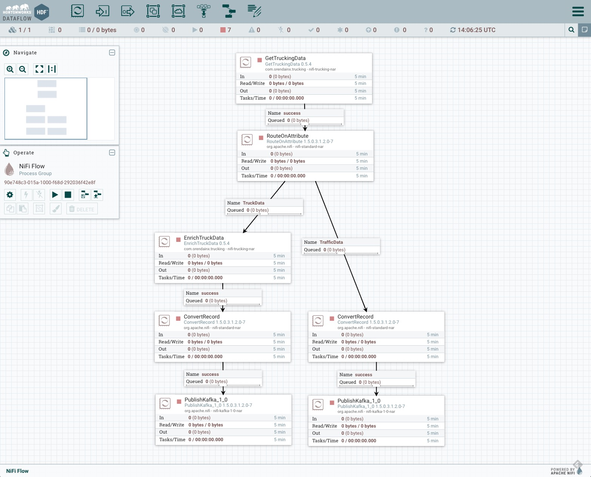
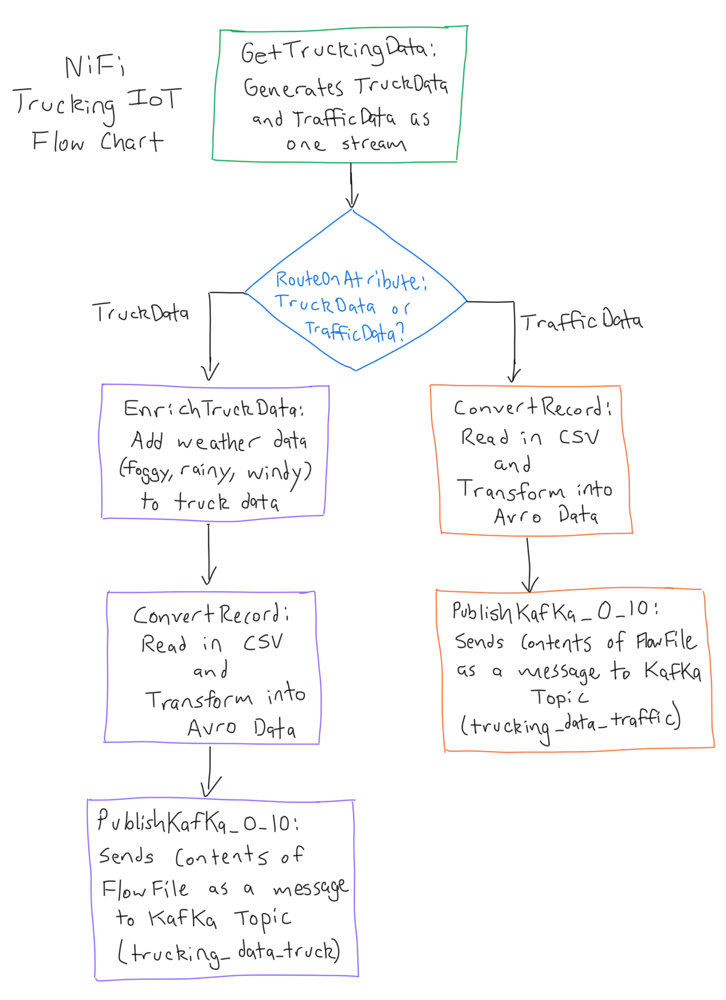

# Run NiFi in the Demo

## Introduction

Let's walk through NiFi's place in the demo.

## Outline

-   [Environment Setup](#environment-setup)
-   [Deploy the NiFi DataFlow](#deploy-the-nifi-dataflow)
-   [Next: Building a NiFi DataFlow](#next-building-a-nifi-dataflow)

## Environment Setup

We will be working on the **trucking-IoT** project. If you have the latest Hortonworks DataFlow (HDF) Sandbox installed, then the demo comes preinstalled.

## Deploy the NiFi DataFlow

Let's activate the NiFi data flow, so it will process the simulated data and push the data into Kafka Topics. Open NiFi at [http://sandbox-hdf.hortonworks.com:9090/nifi/](http://sandbox-hdf.hortonworks.com:9090/nifi/). If not, or you do not already have it setup, then refer to [Setup Demo on existing HDF Sandbox](https://github.com/orendain/trucking-iot/tree/master).

The **Trucking IoT** component template should appear on the NiFi canvas by default as seen below.

To add the **Trucking IoT** template manually do the following:

1.Drag and drop the components template icon  onto the NiFi canvas. Select **Trucking IoT**, then click **ADD**. Deselect the data flow by clicking anywhere on the canvas.

2.In the **Operate Palette** with the hand point upward, expand it if it is closed, click on the gear icon then click on Controller Services gear icon. In Controller Services, check that the state is "Enabled" as seen on the image below.

If it is not "Enabled" follow the steps below:

3.Click on the **Lighting Bolt** to the right of **HortonworksSchemaRegistry**.

4.For **Scope**, select **Service and referencing componen...**,press **ENABLE** then **CLOSE**.

 5.All the Controller Services should be "Enabled" as seen on step 2.

> Note: If any of your services are disabled, you can enable them by clicking on the lightning bolt symbol on the far right of the table. Controller Services are required to be enabled to successfully run the dataflow.

Let's select the entire dataflow. Hold **command** or **ctrl** and **A** and the whole dataflow will be selected. In the **Operate Pallete,** click on the start button  and let it run for 1 minute. The red stop symbols  at the corner of each component in the dataflow will turn to a green play symbol . You should see the numbers in the connection queues change from 0 to a higher number indicating that the data is being processed.

You should see an image similar to the one below:

Let's analyze what actions the processors taking on the data via NiFi's Data Provenance:

Unselect the entire dataflow then right click on `GetTruckingData`: Generates data of two types: _TruckData_ and _TrafficData_. Click **View Data Provenance**.

A table with provenance events will appear. An event illustrates what type of action the processor took against the data. For `GetTruckingData`, it is creating sensor data in two categories as one stream. Choose an event with **20 bytes** to see `TrafficData` or greater than or equal to **98 bytes** to see `TruckData`.

To view `TruckData` or `TrafficData` sensor data select the `i` to the left of the row you want to see. Go to the tab that says **CONTENT**, then **VIEW**.

-   `TruckData`: Data simulated by sensors onboard each truck.

-   `TrafficData`: Data simulated from traffic congestion on a particular trucking route.

You can check the data provenance at each processor to get a more in-depth look at the steps NiFi is performing to process and transform the two types of simulated data. Here is a flow chart to show the steps:

## Next: Building a NiFi DataFlow

Now that we know how NiFi fits into the data pipeline of the demo and what kind of transformations on the data is performing, let's dive into configuring processors to see how the dataflow is constructed.
