# How To Process Data with Apache Pig

## Introduction

In this tutorial, we will learn to store data files using Ambari HDFS Files View. We will implement pig latin scripts to process, analyze and manipulate data files of truck drivers statistics. Let's build our own Pig Latin Scripts now.

## Prerequisites
-  Downloaded and Installed latest [Hortonworks Sandbox](https://hortonworks.com/downloads/#sandbox)
-  [Learning the Ropes of the HDP Sandbox](https://hortonworks.com/tutorial/learning-the-ropes-of-the-hortonworks-sandbox/)
-  Allow yourself around one hour to complete this tutorial

## Outline
- [What is Pig?](#what-is-pig)
- [What is Tez?](#what-is-tez)
- [Our Data Processing Task](#our-data-processing-task)
- [Step 1: Download The Data](#downloading-the-data)
- [Step 2: Upload The Data Files](#uploading-data-files)
- [Step 3: Create Pig Script](#create-pig-script)
- [Full Pig Latin Script for Exercise](#full-pig-script)
- [Step 4: Run Pig Script on Tez](#run-pig-script-tez)
- [Further Reading](#further-reading)

## What is Pig? 

Pig is a high level scripting language that is used with Apache Hadoop. Pig excels at describing data analysis problems as data flows. Pig is complete in that you can do all the required data manipulations in Apache Hadoop with Pig. In addition through the User Defined Functions(UDF) facility in Pig you can have Pig invoke code in many languages like JRuby, Jython and Java. Conversely you can execute Pig scripts in other languages. The result is that you can use Pig as a component to build larger and more complex applications that tackle real business problems.

A good example of a `Pig application` is the `ETL transaction model` that describes how a process will extract data from a source, transform it according to a rule set and then load it into a datastore. Pig can ingest data from files, streams or other sources using the User Defined Functions(UDF). Once it has the data it can perform select, iteration, and other transforms over the data. Again the UDF feature allows passing the data to more complex algorithms for the transform. Finally Pig can store the results into the Hadoop Data File System.

Pig scripts are translated into a series of `MapReduce jobs` that are run on the `Apache  Hadoop cluster`. As part of the translation the Pig interpreter does perform optimizations to speed execution on Apache Hadoop. We are going to write a Pig script that will do our data analysis task.

## What is Tez? 

Tez – Hindi for “speed” provides a general-purpose, highly customizable framework that creates simplifies data-processing tasks across both small scale (low-latency) and large-scale (high throughput) workloads in Hadoop. It generalizes the [MapReduce paradigm](http://en.wikipedia.org/wiki/MapReduce) to a more powerful framework by providing the ability to execute a complex DAG ([directed acyclic graph](http://en.wikipedia.org/wiki/Directed_acyclic_graph)) of tasks for a single job so that projects in the Apache Hadoop ecosystem such as Apache Hive, Apache Pig and Cascading can meet requirements for human-interactive response times and extreme throughput at petabyte scale (clearly MapReduce has been a key driver in achieving this).

## Our Data Processing Task 

We are going to read in a truck driver statistics files. We are going to compute the sum of hours and miles logged driven by a truck driver for an year. Once we have the sum of hours and miles logged, we will extend the script to translate a driver id field into the name of the drivers by joining two different files.

## Step 1: Download The Data 

Download the driver data file from [here](assets/driver_data.zip).
Once you have the file you will need to `unzip` the file into a directory. We will be uploading two csv files - `drivers.csv` and `timesheet.csv`.

## Step 2: Upload the data files 

We start by selecting the `HDFS Files view` from the Off-canvas menu at the top. The `HDFS Files view` allows us to view the Hortonworks Data Platform(HDP) file store. This is separate from the local file system. For the Hortonworks Sandbox, it will be part of the file system in the Hortonworks Sandbox VM.

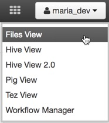

Navigate to `/user/maria_dev` and click on the Upload button to select the files we want to upload into the Hortonworks Sandbox environment.

Click on the browse button to open a dialog box. Navigate to where you stored the `drivers.csv` file on your local disk and select `drivers.csv` and click `Open`. Do the same thing for `timesheet.csv`. When you are done you will see there are two new files in your directory.

## Step 3: Create Pig Script 

Now that we have our data files, we can start writing our `Pig script`. Click on the `Pig View` from the Off-canvas menu.

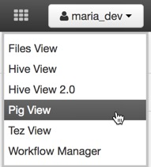

You can also explore **Grunt shell** from the terminal which is used to write Pig Latin scripts. There are 3 execute modes of accessing Grunt shell:

1. local - Type `pig -x local` to enter the shell
2. mapreduce - Type `pig -x mapreduce` to enter the shell
3. tez - Type `pig -x tez` to enter the shell

Default is mapreduce, so if you just type `pig`, it will use mapreduce as the execution mode.
Explore this [link](https://pig.apache.org/docs/r0.16.0/cmds.html) to explore more about the grunt shell.

### 3.1 Explore the Pig User Interface

We see the `Pig user interface` in our browser window. On the left we can choose between our `saved Pig  Scripts`,  `UDFs`  and the `Pig  Jobs` executed in the past. To the right of this menu bar we see our `saved Pig  Scripts`.

### 3.2 Create a New Script

To get started push the button `"New Script"` at the top right and fill in a name for your script. If you leave the gap “Script HDFS Location” empty, it will be filled automatically.

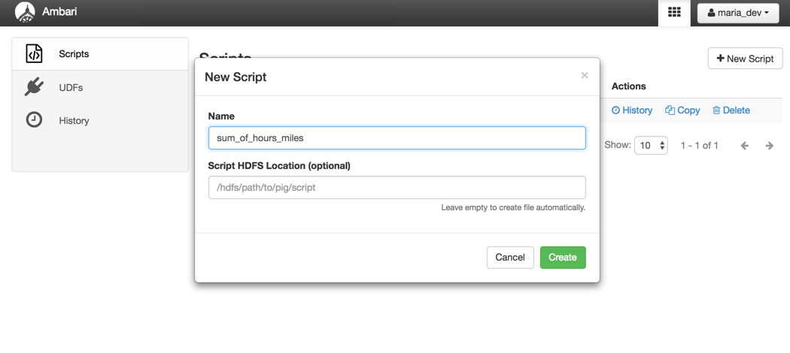

After clicking on “create”, a new page opens.
At the center is the composition area where we will be writing our script. At top right of the composition area are buttons to `Execute`, `Explain  and perform a Syntax check` of the current script.
At the left are buttons to save, copy or delete the script and at the very bottom we can add a argument.

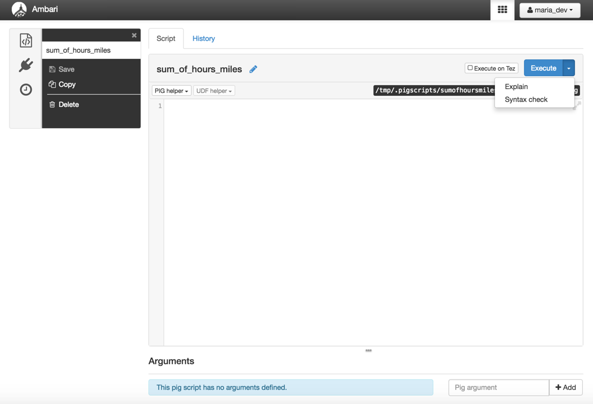

### 3.3 Create a Script to Load drivers.csv Data

The first thing we need to do is load the data. We use the load statement for this. The `PigStorage` function is what does the loading and we pass it a `comma` as the data `delimiter`. Our code is:

~~~
drivers = LOAD 'drivers.csv' USING PigStorage(',');
~~~

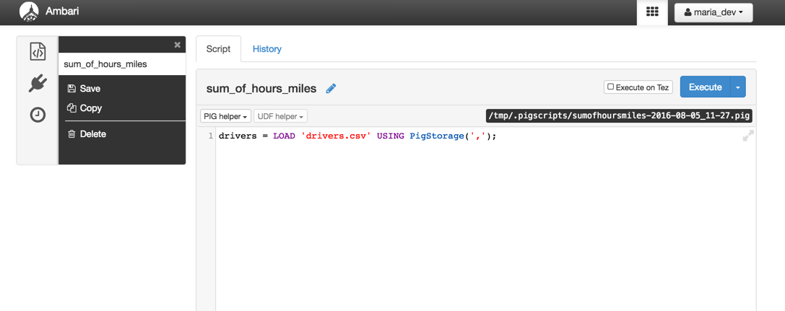

### 3.4 Create a Script to Filter Out Data

To filter out the first row of the data we have to add this line:

~~~
raw_drivers = FILTER drivers BY $0>1;
~~~

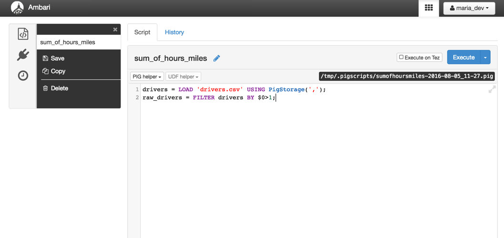

### 3.5 Implement a Script to Name the Fields

The next thing we want to do is name the fields. We will use a `FOREACH` statement to iterate through the raw_drivers data object. We can use `Pig  Helper` that is at the bottom of the composition area to provide us with a template. We will click on `Pig  Helper`, select Data processing functions and then click on the `FOREACH template`. We can then replace each element by hitting the tab key.

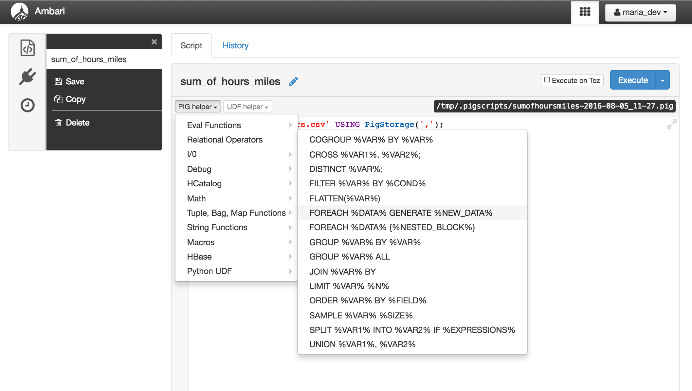

So the `FOREACH` statement will iterate through the raw_drivers data object and `GENERATE` pulls out selected fields and assigns them names. The new data object we are creating is then named `driver_details`. Our code will now be:

~~~
drivers_details = FOREACH raw_drivers GENERATE $0 AS driverId, $1 AS name;
~~~

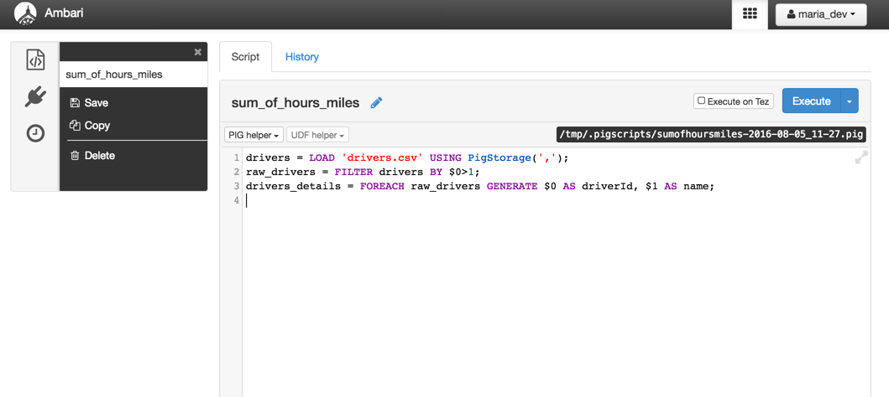

### 3.6 Perform these operations for timesheet data as well

Load the `timesheet` data and then filter out the first row of the data to remove column headings and then use `FOREACH` statement to iterate each row and `GENERATE` to pull out selected fields and assign them names.

~~~
timesheet = LOAD 'timesheet.csv' USING PigStorage(',');
raw_timesheet = FILTER timesheet by $0>1;
timesheet_logged = FOREACH raw_timesheet GENERATE $0 AS driverId, $2 AS hours_logged, $3 AS miles_logged;
~~~

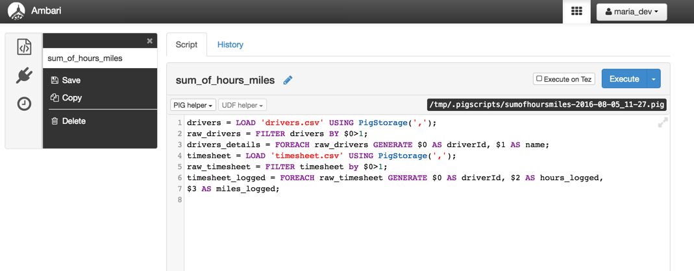

### 3.7 Use Script to Filter The Data (all hours and miles for each driverId)

The next line of code is a `GROUP` statement that groups the elements in `timesheet_logged` by the `driverId` field. So the `grp_logged` object will then be indexed by `driverId`. In the next statement as we iterate through `grp_logged` we will go through driverId by driverId. Type in the code:

~~~
grp_logged = GROUP timesheet_logged by driverId;
~~~

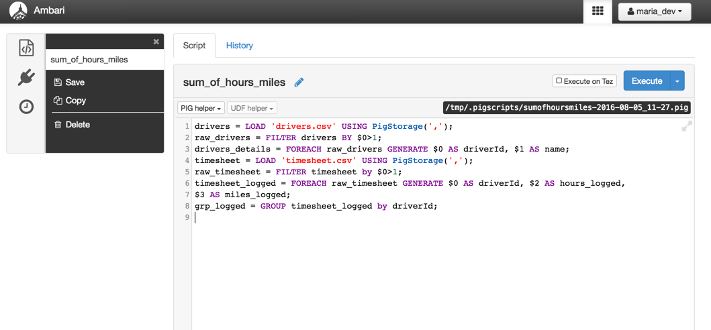

### 3.8 Compose a Script to Find the Sum of Hours and Miles Logged by each Driver

In the next `FOREACH` statement, we are going to find the sum of hours and miles logged by each driver. The code for this is:

~~~
sum_logged = FOREACH grp_logged GENERATE group as driverId,
SUM(timesheet_logged.hours_logged) as sum_hourslogged,
SUM(timesheet_logged.miles_logged) as sum_mileslogged;
~~~

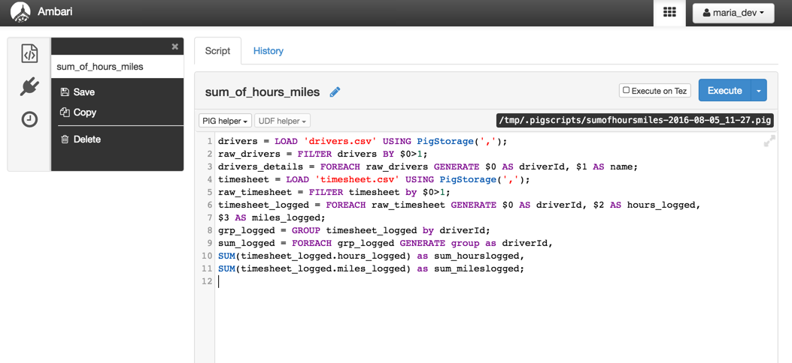

### 3.9 Build a Script to join driverId, Name, Hours and Miles Logged

Now that we have the sum of hours and miles logged, we need to join this with the `driver_details` data object so we can pick up the name of the driver. The result will be a dataset with `driverId, name, hours logged and miles logged`. At the end we `DUMP` the data to the output.

~~~
join_sum_logged = JOIN sum_logged by driverId, drivers_details by driverId;
join_data = FOREACH join_sum_logged GENERATE $0 as driverId, $4 as name, $1 as hours_logged, $2 as miles_logged;
dump join_data;
~~~

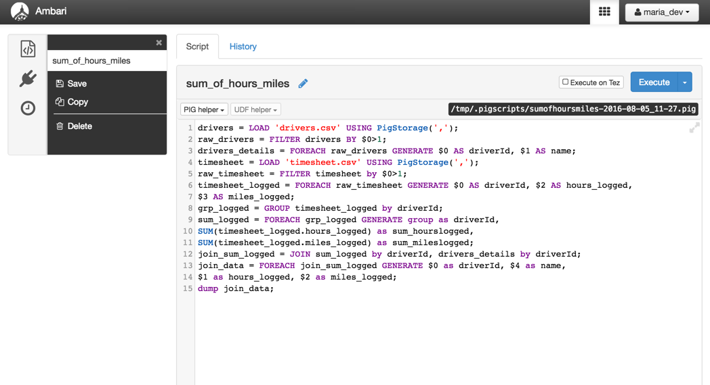

Let’s take a look at our script. The first thing to notice is we never really address single rows of data to the left of the equals sign and on the right we just describe what we want to do for each row. We just assume things are applied to all the rows. We also have powerful operators like `GROUP` and `JOIN` to sort rows by a key and to build new data objects.

### 3.10 Save and Execute The Script

At this point we can save our script. Let's execute our code by clicking on the `Execute` button at the top right of the composition area, which opens a new page.

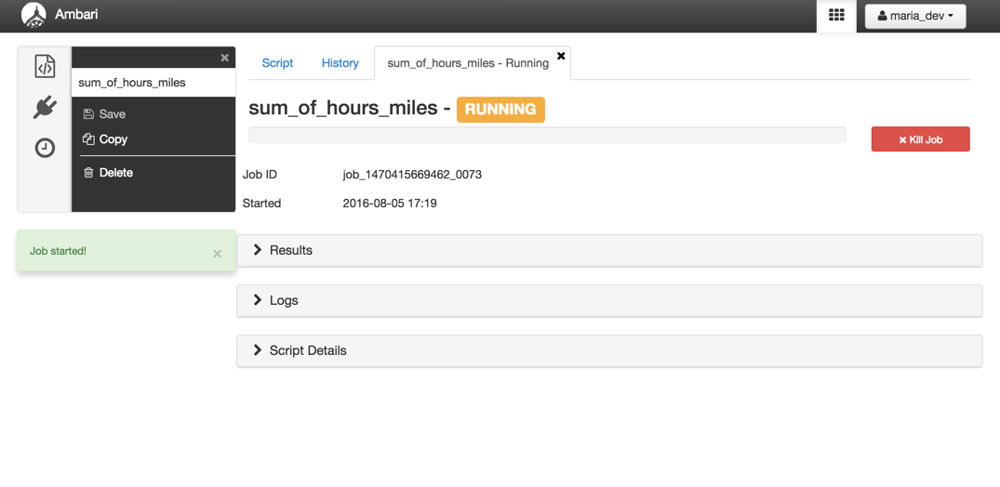

As the jobs are run we will get status boxes where we will see logs, error message, the output of our script and our code at the bottom.

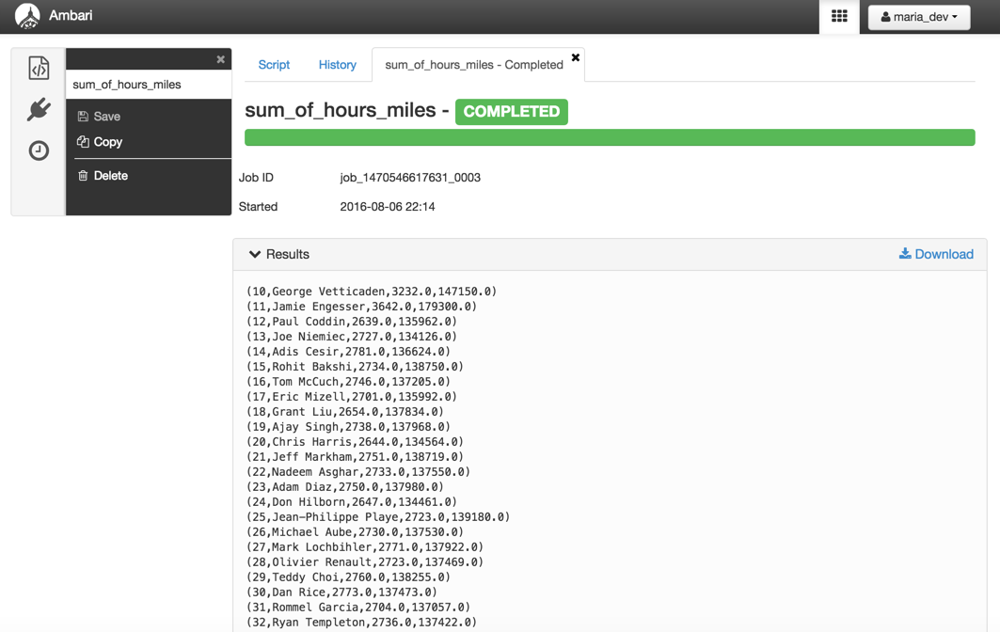

If you scroll down to the “Logs…” and click on the link you can see the log file of your jobs. We should always check the Logs to check if your script was executed correctly.

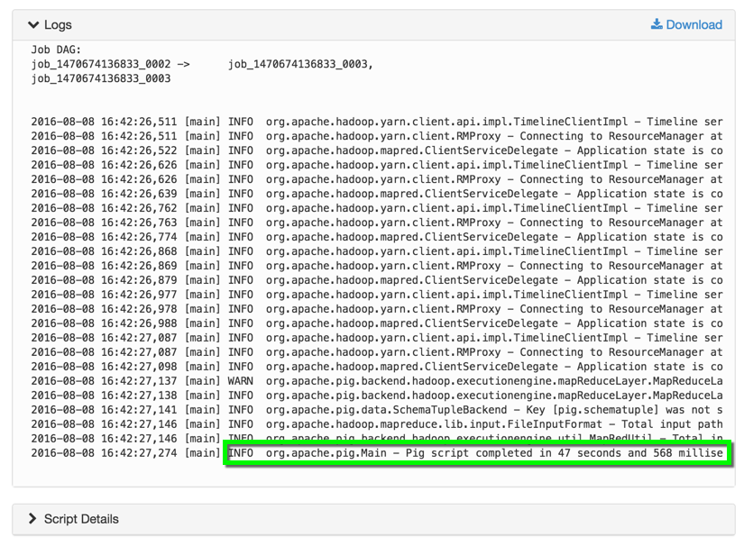

**NOTE: In the Logs, the script typically takes a little around 47 seconds to finish on our single node pseudo cluster.**

### Code Recap

So we have created a simple `Pig script` that **reads in some comma separated data**.
Once we have that set of records in Pig we **pull out the driverId, hours logged and miles logged fields from each row.**
We then **group them by driverId** with one statement, **GROUP**.
Then we **find the sum of hours and miles logged for each driverId**.
This is finally **mapped to the driver name by joining two datasets** and we produce our final dataset.

As mentioned before `Pig` operates on data flows. We consider each group of rows together and we specify how we operate on them as a group. As the datasets get larger and/or add fields our `Pig script` will remain pretty much the same because it is concentrating on how we want to manipulate the data.

## Full Pig Latin Script for Exercise 

~~~
drivers = LOAD 'drivers.csv' USING PigStorage(',');
raw_drivers = FILTER drivers BY $0>1;
drivers_details = FOREACH raw_drivers GENERATE $0 AS driverId, $1 AS name;
timesheet = LOAD 'timesheet.csv' USING PigStorage(',');
raw_timesheet = FILTER timesheet by $0>1;
timesheet_logged = FOREACH raw_timesheet GENERATE $0 AS driverId, $2 AS hours_logged, $3 AS miles_logged;
grp_logged = GROUP timesheet_logged by driverId;
sum_logged = FOREACH grp_logged GENERATE group as driverId,
SUM(timesheet_logged.hours_logged) as sum_hourslogged,
SUM(timesheet_logged.miles_logged) as sum_mileslogged;
join_sum_logged = JOIN sum_logged by driverId, drivers_details by driverId;
join_data = FOREACH join_sum_logged GENERATE $0 as driverId, $4 as name, $1 as hours_logged, $2 as miles_logged;
dump join_data;
~~~

## Step 4: Run Pig Script on Tez 

Let’s run the same Pig script with Tez by clicking on `Execute on Tez` button near the `Execute` button:

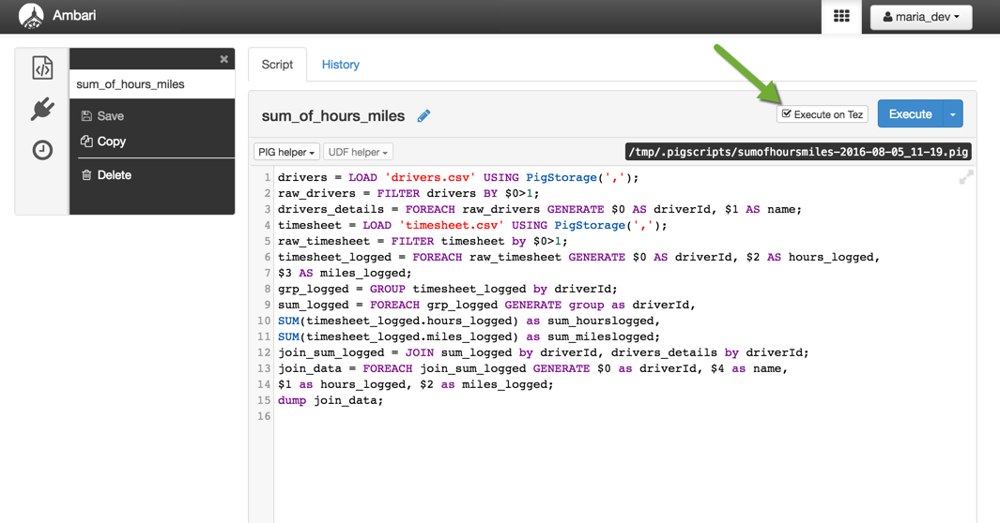

Notice the time after the execution completes:

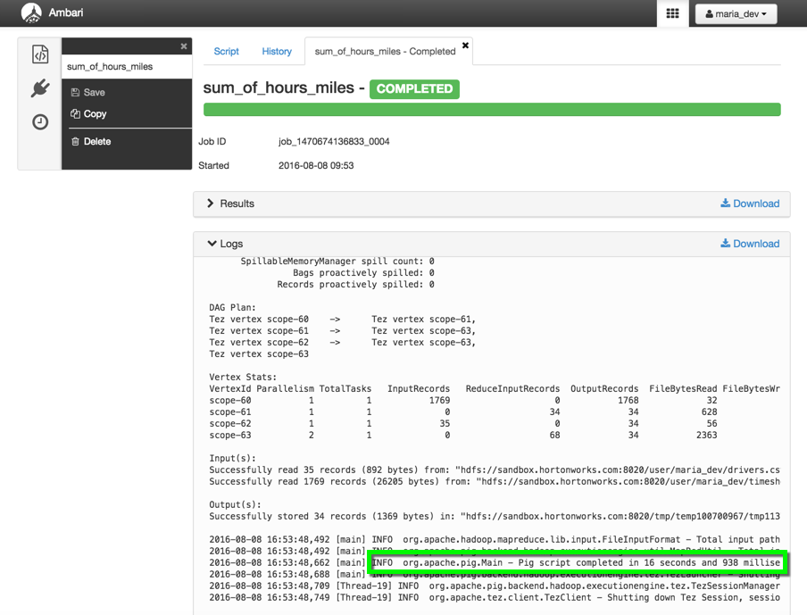

On our machine it took around 16 seconds with Pig using the Tez engine. That is more than 2X faster than Pig using MapReduce even without any specific optimization in the script for Tez.
Tez definitely lives up to it’s name.

## Further Reading 
-   [Welcome to Apache Pig!](https://pig.apache.org/)
-   [Pig Latin Basics](https://pig.apache.org/docs/r0.12.0/basic.html#store)
-   [Programming Pig](http://www.amazon.com/Programming-Pig-Alan-Gates/dp/1449302645)
-   [Apache Tez](https://hortonworks.com/apache/tez/)
